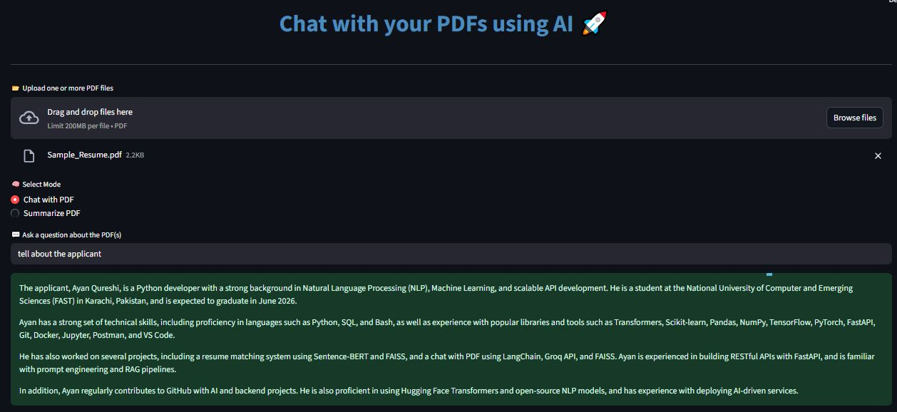
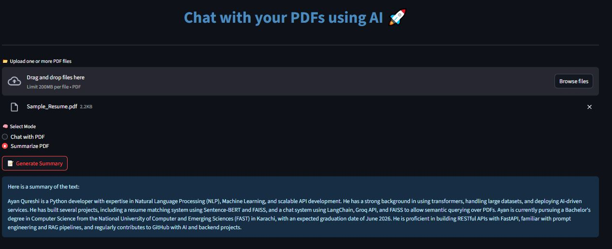

# 📚 Smart PDF Chatbot 🤖

**Smart PDF Chatbot** is a user-friendly, AI-powered application that lets you **chat with your PDF documents** or **generate meaningful summaries** using **Groq LLaMA 3** models and **FAISS-based retrieval**. Whether it’s a resume, course notes, research paper, or any general PDF – just upload and chat away!

🔗 **Live Demo:**  
👉 [https://smart-pdf-chatbot-7m3xiqxgrtyx6vidcmhlfs.streamlit.app/](https://smart-pdf-chatbot-7m3xiqxgrtyx6vidcmhlfs.streamlit.app/)

---

## ✨ Features

- 📂 Upload one or more PDFs
- 💬 Ask contextual questions about the uploaded PDF
- 📝 Generate concise summaries from lengthy documents
- 🧠 Uses **LangChain**, **Groq’s LLaMA 3**, and **HuggingFace Embeddings**
- 🧾 Powered by **FAISS** for efficient document retrieval
- 🌐 Deployed with **Streamlit Cloud**

---

## 📁 Project Structure

```

smart-pdf-chatbot/
│
├── app/
│   ├── pdf\_utils.py         # PDF reading and preprocessing
│   ├── rag\_utils.py         # Vectorstore, QA & Summary chain setup
│   └── groq\_setup.py        # Groq LLM setup
│
├── .gitignore               # Ignores .env and other unnecessary files
├── .env                     # Contains GROQ\_API\_KEY (not pushed)
├── streamlit\_app.py         # Main Streamlit app logic
├── chat.jpg                 # Screenshot of "Chat with PDF" feature
├── summarize.JPG            # Screenshot of "Summarize PDF" feature
└── README.md                # This file 📝

````
---

## ⚙️ Installation & Setup

> 💡 Make sure Python 3.10+ is installed.

### 1. Clone the repo

```bash
git clone https://github.com/your-username/smart-pdf-chatbot.git
cd smart-pdf-chatbot
````

### 2. Install dependencies

```bash
pip install -r requirements.txt
```

### 3. Add your Groq API Key

Create a `.env` file in the root folder:

```env
GROQ_API_KEY=your_groq_api_key_here
```

### 4. Run the app locally

```bash
streamlit run streamlit_app.py
```

---

## 🌐 Deployment

This app is deployed live on **Streamlit Cloud**:
🔗 [https://smart-pdf-chatbot-7m3xiqxgrtyx6vidcmhlfs.streamlit.app/](https://smart-pdf-chatbot-7m3xiqxgrtyx6vidcmhlfs.streamlit.app/)

To deploy your own:

1. Push your project to GitHub
2. Go to [Streamlit Community Cloud](https://streamlit.io/cloud)
3. Click **New App**, connect your repo, select branch & file (e.g. `streamlit_app.py`)
4. Add your `GROQ_API_KEY` to **Secrets**
5. Deploy 🚀

---

## 📌 Use Cases

* 🧑‍💼 Resume Parsing & Q/A
* 📚 Chat with Course Notes
* 🧠 Summary of Research Articles
* 📄 Legal Document Exploration
* 📖 Book & Chapter summarization

---

## ⚠️ Known Limitations & Future Improvements

| Issue                              | Description                                                                                                                                                                       |
| ---------------------------------- | --------------------------------------------------------------------------------------------------------------------------------------------------------------------------------- |
| ❌ **Token Overflow**               | The free-tier Groq LLaMA 3 API has a **6000 TPM (Tokens per Minute)** limit. Uploading large PDFs (e.g., scanned books or full-length research reports) may trigger `413` errors. |
| 🧠 **Limited Retrieval Chunks**    | The model currently retrieves top `k=2` chunks. More intelligent chunk merging or chunk ranking can be added.                                                                     |
| 📊 **Lacks Metadata Handling**     | It does not yet show source documents or document metadata in answers.                                                                                                            |
| 📈 **No History or Feedback Loop** | The app does not yet store chat history or learn from previous queries.                                                                                                           |
| 🚀 **Upgrade to Pro APIs**         | Support for **higher-token** Groq plans (Dev tier) or multi-modal inputs (PDF+images) could be added in future releases.                                                          |

✅ **It works great** for:

* Resumes
* Computer science PDFs
* Short to mid-sized documents
* Class notes & assignments

---




## 🙌 Credits

* [LangChain](https://www.langchain.com/)
* [Groq LLaMA 3](https://console.groq.com/)
* [Streamlit](https://streamlit.io/)
* [HuggingFace Embeddings](https://huggingface.co/sentence-transformers/all-MiniLM-L6-v2)

---

## 📬 Contact

Built with ❤️ by [Ali Haris](https://github.com/Aliharis007)
Feel free to contribute, raise issues, or drop a ⭐ if you like this!

```
